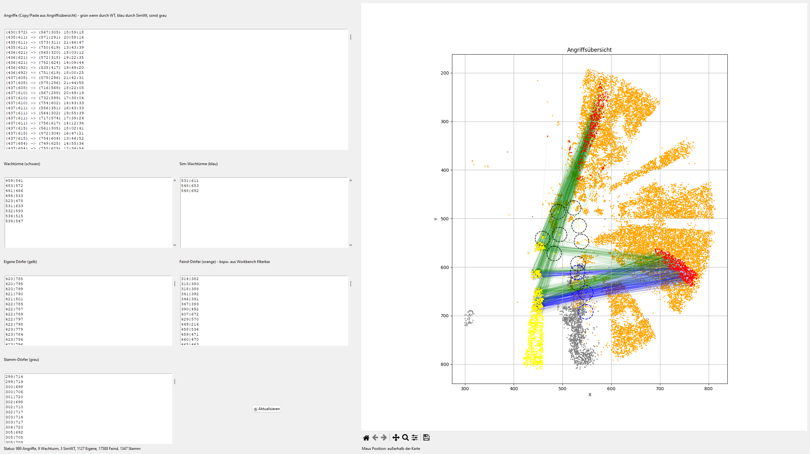

# 🛡️ Angriffsvisualisierung – Die Stämme

Eine Python-basierte GUI-Anwendung zur Visualisierung von Angriffen und Dorfpositionen im Spiel **"Die Stämme"**. Die Anwendung hilft dabei, Angriffe zu analysieren, Wachturm-Abdeckungen zu prüfen und Dörfer farblich nach Zugehörigkeit darzustellen.

## 📸 Vorschau



---

## 🔧 Funktionen

- Eingabe von Angriffsdaten (Copy/Paste aus Angriffsübersicht gesamte Seite)
- Visualisierung von:
  - Feindlichen und eigenen Dörfern
  - Wachtürmen und Simulations-Wachtürmen mit Abdeckungsradius
  - Stammesdörfern
  - Angriffspfeilen inkl. Farbmarkierung je nach Abdeckung
  - Start- und Zieldörfern von Angriffen
- Zoom & Pan auf der Karte
- Mauskoordinatenanzeige unterhalb der Karte
- Automatische Formatierung der Eingaben
- Zustand bleibt beim Neustart erhalten (via JSON-Datei)

---

## ⚙️ Installation

### 1. Voraussetzungen

- Python 3.8 oder höher
- Empfohlen: PyCharm Community als Editor

### 2. Installation

Klonen des Repository, danach installieren der fehlenden Pakete:
```bash
pip install -r requirements.txt
```

---

## 📝 Eingabeformate

### Angriffe

Format:
Einfach Copy/Paste der kompletten Seite Angriffsübersicht (Eingehendes). Auch wenn Sachen wie Dorfname, Schnellleiste usw. dabei sind, ist es egal.

Beispiel:
```
  Angriff 	C19 - [Verifizierter Grauadler] (440|671) K64	#MelancholyHill TFD (641|549) K56	Melancholy Hill	235.1	am 03.08. um 13:15:16:457	---	116:27:03
  Angriff 	C19 - [Verifizierter Grauadler] (448|643) K64	#MelancholyHill TFD (672|565) K56	Melancholy Hill	237.2	am 03.08. um 14:16:54:736	---	117:28:41
  Angriff 	C19 - [Verifizierter Grauadler] (444|644) K64	#MelancholyHill TFD (667|563) K56	Melancholy Hill	237.3	am 03.08. um 14:19:49:314	---	117:31:28
```

Nach Parsen wird das ganze wie folgt vereinfacht:
```
  (430|572) -> (567|305) 15:59:18
  (435|611) -> (571|291) 20:58:16
  (435|611) -> (573|311) 21:46:47
```

### Koordinaten (Wachturm, Dörfer usw.)

Einfach Zeile pro Koordinate im Format:
```
499|501
500|502
```
oder aber auch 
```
AG KOMMT	533|613	7.948
[coords]548|692[/coords]
7. [coords]548|700[/coords]
```

---

## 📝 Eingaben anwenden

Durch Druck auf "Aktualisieren"


---

## 🎨 Farbcodierung

#### Angriffe

| Farbe     | Bedeutung                          |
|-----------|-------------------------------------|
| 🟢 Grün    | Angriff **trifft realen Wachturm** |
| 🔵 Blau    | Angriff **trifft simulierten Wachturm** |
| ⚪ Grau    | Angriff **trifft keinen Wachturm** |

---

#### Angriffsdörfer

| Farbe                                   | Bedeutung                        |
|----------------------------------------|----------------------------------|
| 🟡 **Gelb mit schwarzer Umrandung**     | **Ziel-Dorf** eines Angriffs     |
| 🔴 **Rot mit schwarzer Umrandung**      | **Start-Dorf** (Herkunft) eines Angriffs |

---

#### Wachtürme

| Farbe     | Typ                                  |
|-----------|--------------------------------------|
| ⚫ Schwarz | **Realer Wachturm** (inkl. Kreis mit Radius 15) |
| 🔵 Blau    | **Simulierter Wachturm** (inkl. Kreis mit Radius 15) |

---

#### Sonstiges

| Farbe     | Bedeutung             |
|-----------|------------------------|
| 🟡 Gelb    | **Eigene Dörfer**      |
| 🔴 Rot     | **Feindliche Dörfer**  |
| ⚪ Grau    | **Stammesdörfer**      |

---

> Hinweis: Pfeile zeigen immer von **Herkunft → Ziel**.

---

## 💾 Datenpersistenz

Alle Eingaben werden lokal gespeichert in:

```
angriffsvisualisierung_data.json
```

Beim nächsten Start werden diese automatisch wiederhergestellt.

---

## 🐞 Bekannte Einschränkungen

- Keine detaillierte Fehlerprüfung der Eingaben
- Kein Undo/Redo
- Keine Mehrbenutzer-/Profilverwaltung
- UI unflexibel und langsam (bei zoomen usw.)
- Aktualisieren dauert lange bei vielen Dörfern
- Keine Auswahlliste wie bei WB, es muss stattdessen alles reinkopiert werden

---

## 📂 Projektstruktur

```
.
├── main.py                          # Einstiegspunkt
├── ui.py                            # Benutzeroberfläche (Tkinter + Matplotlib)
├── model.py                         # Datenmodell (AttackData)
├── utils.py                         # Parser & Hilfsfunktionen
├── persistence.py                   # Speichern/Laden als JSON
├── angriffsvisualisierung_data.json # Gespeicherter Zustand
├── requirements.txt                 # Abhängigkeiten
└── README.md                        # Diese Datei
```

---

## 👤 Autor

Entwickelt von **Jonas Weis**

Lizenz: MIT

---
